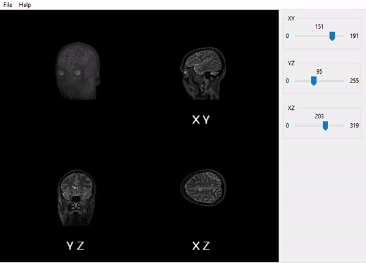

# ecvl-applications

This repository contains sample [ecvl](https://github.com/deephealthproject/ecvl) applications.

## Requirements
- CMake 3.13 or later;
- C++ Compiler with C++17 support;
- [OpenCV 3.0](https://opencv.org/) or later (modules required: core, imgproc, imgcodecs, photo, [calib3d since OpenCV 4.0 only]).

## Build
#### wxWidgets
```bat
git clone --recursive https://github.com/wxWidgets/wxWidgets.git
cd wxWidgets
git checkout <last-release>
mkdir bin && cd bin
cmake -DwxUSE_LIBJPEG=OFF -DwxUSE_LIBTIFF=OFF -DwxUSE_RIBBON=OFF \
  -DwxBUILD_SHARED=OFF -DwxBUILD_USE_STATIC_RUNTIME=ON -DCMAKE_INSTALL_PREFIX=install \
  ..
cmake --build . --config Release --target INSTALL
cmake --build . --config Debug --target INSTALL
```

#### ECVL
```bat
git clone https://github.com/deephealthproject/ecvl.git
cd ecvl
git checkout <last-release>
mkdir bin && cd bin
cmake -DECVL_BUILD_GUI=ON -DECVL_WITH_OPENGL=ON \
  -DECVL_BUILD_EDDL=OFF -DECVL_SHARED=OFF \
  -DOpenCV_DIR=/path/to/opencv/build_dir \
  -DwxWidgets_LIB_DIR=/path/to/wxWidgets/bin/install/lib/vc_x64_lib \
  -DwxWidgets_ROOT_DIR=/path/to/wxWidgets/bin/install \
  -DCMAKE_INSTALL_PREFIX=install \
  ..
cmake --build . --config Release --target INSTALL
cmake --build . --config Debug --target INSTALL
```

#### ecvl-applications
```bat
git clone https://github.com/deephealthproject/ecvl-applications
cd ecvl-applications/viewer REM Or cd ecvl-applications/projections
mkdir bin && cd bin
cmake -DECVL_DIR=/path/to/ecvl/bin/install ..
cmake --build . --config Release
Release\viewer.exe REM Or projections.exe
```

## projections
A volume rendering tool for NIfTI images.



## viewer
A 2D Image viewer that exploits ECVL editing tools.


