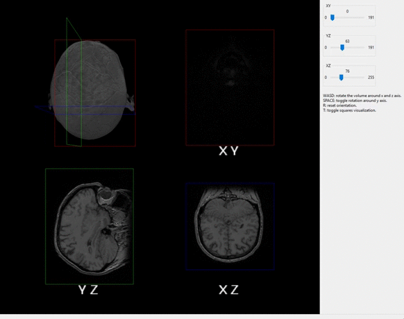

# ecvl-applications

This repository contains sample [ecvl](https://github.com/deephealthproject/ecvl) applications.

### projections

A volume rendering tool for NIfTI images.

### viewer

A 2D Image viewer that exploits ECVL editing tools.

